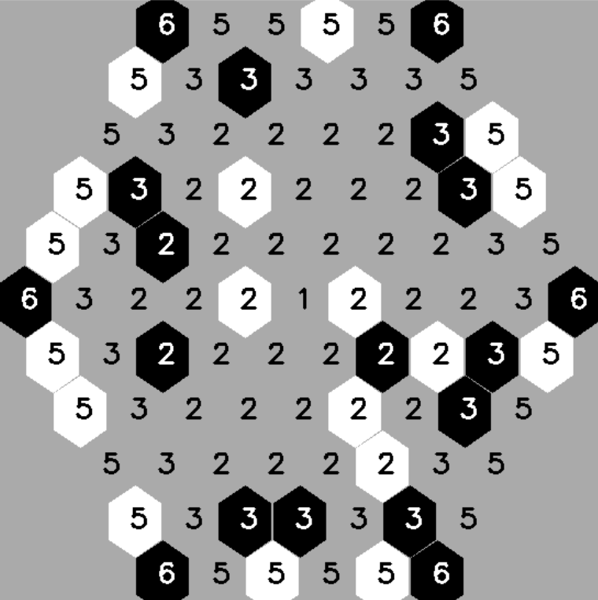

In this repo, I experimented with Reinforcement learning on the game of Strands.
I implemented a gym environment an trained a DQN agent to play the game.
Strands is a simple strategy game where players take turns covering empty spaces on a hexagonal grid. It has similarities to Go.

## Rules
One player has white stones, the other player has black. The game is played on a hexagonal grid, with hexagons marked with the numbers from 1 to 6

1. Start by covering any spaces marked "2" with Black.

2. Then, starting with White, take turns covering up to X empty spaces marked "X". For example, you could cover any 3 empty spaces marked "3".

3. If the board is full, the game ends. The player with the largest contiguous group of stones wins. If tied, compare the players' second-largest groups, and so on, until you come to a pair which aren't the same size. Whoever owns the larger wins.

The game can be played with smaller (size 7, ie 7 squares of diameter) or bigger boards (size 11, ie 11 squares of diameter)

## Resources
- [Where to play](https://en.boardgamearena.com/gamepanel?game=strands)
- [Post about Advanced Strategy](https://boardgamegeek.com/thread/3114220/strands-strategy-primer)
- [Deep Reinforcement Learning Course](https://huggingface.co/learn/deep-rl-course/unit0/introduction)

## Reference papers

- TD-gammon (Gerald Tesauro,1995, https://www.csd.uwo.ca/~xling//cs346a/extra/tdgammon.pdf)
- Playing Atari with Deep Reinforcement Learning (Deepmind, 2013, https://arxiv.org/abs/1312.5602)